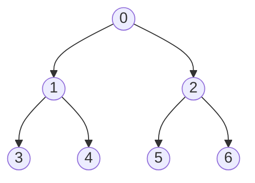
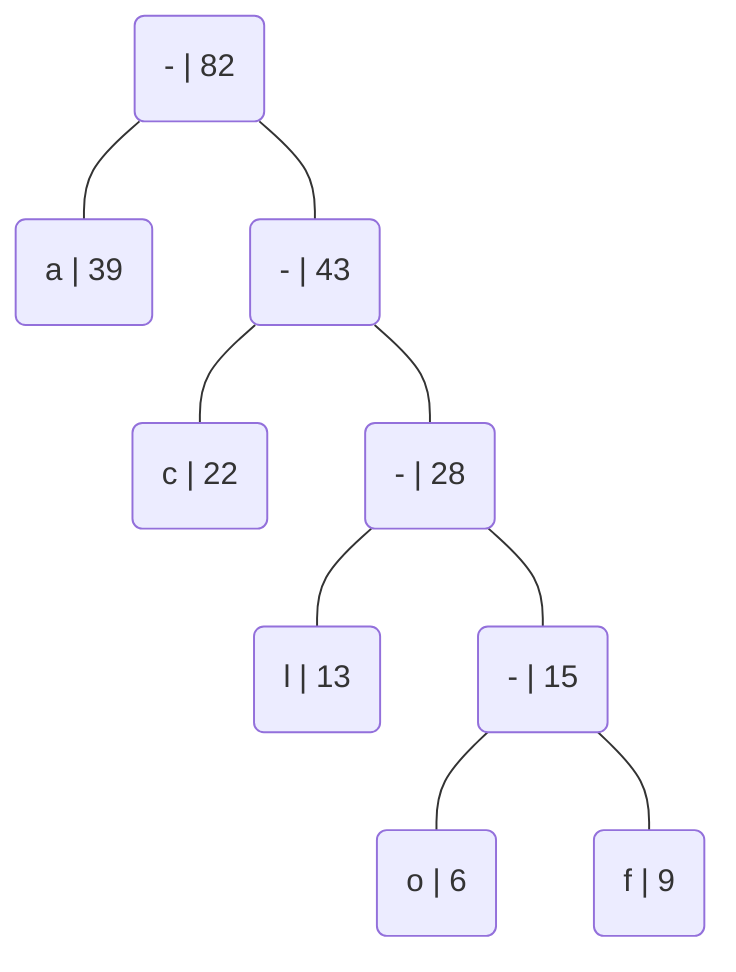

# markdowntester

## ingredients

    
Toggle Switch

    Test

Problem 3: Huffman encoding
8 points total; individual-only

Consider the following table of character frequencies:

| Character | Frequency | 
| - | - | 
| o | 6 |
| f | 9 |
| l | 13 |
| c | 22 |
| a | 30 |

1. (6 points) Show the Huffman tree that would be constructed from these character frequencies by editing the diagram that we have provided in section 3-1 of ps9_partI. It includes the some of the necessary nodes and edges, but you should create more of them as needed, move them into the appropriate positions, and connect them.

2. (2 points) Using the Huffman tree from part 1, what will be the encoding of the string focal?

